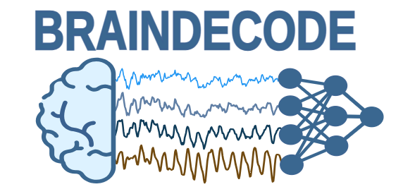
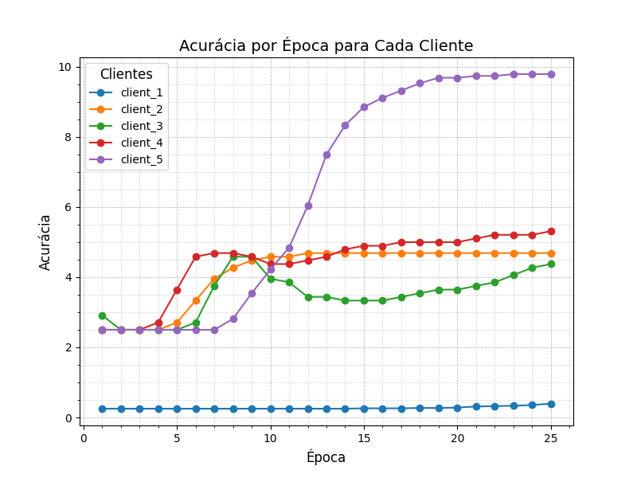

## Inspiração

Artigo: "Aggregating intrinsic information to enhance BCI performance through
federated learning"

- **Desafio de Dados Insuficientes em BCI**: 
  - A falta de dados é um desafio antigo para construir modelos de aprendizado profundo de alto desempenho em Interfaces Cérebro-Computador (BCI).
  - Mesmo com diversos grupos coletando conjuntos de dados de EEG para a mesma tarefa, o compartilhamento de dados entre dispositivos é difícil devido à heterogeneidade dos dispositivos.

- **Importância da Diversidade de Dados**:
  - A diversidade de dados é fundamental para a robustez dos modelos, mas poucos trabalhos abordam essa questão, concentrando-se principalmente no treinamento de modelos dentro de um único conjunto de dados.

- **Proposta de Solução**:
  - **FLEEG (Federated Learning EEG Decoding)**: Estrutura hierárquica personalizada de aprendizado federado para superar o desafio da diversidade de dados.
  - Permite que conjuntos de dados com formatos diferentes colaborem no processo de treinamento do modelo.

- **Funcionamento do Framework**:
  - Cada cliente recebe um conjunto de dados específico e treina um modelo hierárquico personalizado.
  - O servidor coordena o treinamento para compartilhar conhecimento entre todos os conjuntos de dados, melhorando o desempenho geral.

- **Contribuição Inovadora**:
  - Primeira solução end-to-end para enfrentar o desafio de heterogeneidade nos dados de EEG em BCI.


## Proposta

Federar modelo proposto em: [**How to train, test and tune your model?**](https://braindecode.org/stable/auto_examples/model_building/plot_how_train_test_and_tune.html#sphx-glr-auto-examples-model-building-plot-how-train-test-and-tune-py). Este tutorial mostra como treinar, ajustar e testar adequadamente seus modelos de aprendizado profundo com o [**Braindecode**](https://braindecode.org/stable/index.html). Usaremos o conjunto de dados [**BCIC IV 2a**](https://braindecode.org/stable/auto_examples/model_building/plot_how_train_test_and_tune.html#id5) como exemplo de demonstração. **Os eventos considerados nos dados são apenas as 4 classes alvo (esquerda, direita, pé, língua).**

### Braindecode



O Braindecode é uma ferramenta open-source em Python para decodificação de dados cerebrais EEG com modelos de aprendizado profundo. Aplicações:
-   Pré-processamento
-   Visualização de dados
-   Implementações de várias arquiteturas de aprendizado profundo

Assim, o dataset será dividido em cinco partes, e cada uma delas passará por um pré-processamento específico. Em seguida, cada parte será alocada para um cliente diferente, com o objetivo de verificar como o aprendizado federado pode melhorar a performance e a capacidade de generalização do modelo aplicado.

## Prática
### Instalação de bibliotecas
```python
!pip install braindecode moabb ray
!pip install -U "flwr[simulation]"
```
### Carregar o dataset
```python
from braindecode.datasets import MOABBDataset
from sklearn.model_selection import train_test_split
```

```python
import numpy as np
from braindecode.preprocessing import (
    exponential_moving_standardize,
    preprocess,
    Preprocessor,
)

# Carregar o dataset
subject_id = 3
dataset = MOABBDataset(dataset_name="BNCI2014_001", subject_ids=[subject_id])

# Dividir o dataset em 5 partes manualmente
num_parts = 5
part_size = len(dataset.datasets) // num_parts
dataset_parts = []

# Separar manualmente os dados e recriar subconjuntos como novos datasets
for i in range(num_parts):
    start = i * part_size
    end = (i + 1) * part_size if i < num_parts - 1 else len(dataset.datasets)
    subset = dataset.datasets[start:end]
    dataset_parts.append(subset)

# Definir diferentes conjuntos de parâmetros para cada parte
param_sets = [
    {"low_cut_hz": 4.0, "high_cut_hz": 30.0, "factor_new": 1e-3, "init_block_size": 1000},
    {"low_cut_hz": 5.0, "high_cut_hz": 35.0, "factor_new": 5e-4, "init_block_size": 1200},
    {"low_cut_hz": 3.5, "high_cut_hz": 28.0, "factor_new": 2e-3, "init_block_size": 900},
    {"low_cut_hz": 6.0, "high_cut_hz": 40.0, "factor_new": 1e-4, "init_block_size": 1500},
    {"low_cut_hz": 4.5, "high_cut_hz": 32.0, "factor_new": 1e-3, "init_block_size": 1100},
]

# Lista para armazenar os datasets processados
processed_datasets = []

# Aplicar os preprocessadores a cada subconjunto com parâmetros específicos
for i, (subset, params) in enumerate(zip(dataset_parts, param_sets)):
    preprocessors = [
        Preprocessor("pick_types", eeg=True, meg=False, stim=False),
        Preprocessor(lambda data, factor: np.multiply(data, factor), factor=1e6),
        Preprocessor("filter", l_freq=params["low_cut_hz"], h_freq=params["high_cut_hz"]),
        Preprocessor(exponential_moving_standardize, factor_new=params["factor_new"], init_block_size=params["init_block_size"]),
    ]

    # Criar um novo dataset a partir do subconjunto
    new_dataset = MOABBDataset(dataset_name="BNCI2014_001", subject_ids=[subject_id])
    new_dataset.datasets = subset  # Atribuir subconjunto ao novo dataset

    # Preprocessar o novo dataset de forma independente
    preprocess(new_dataset, preprocessors, n_jobs=-1)
    print(f"Preprocessamento concluído para o subconjunto {i+1} com parâmetros: {params}")

    # Armazenar o dataset processado na lista
    processed_datasets.append(new_dataset)
```

### Criação de janelas de tempo

A função ***extractionWindow*** tem o objetivo criar "janelas" que correspondem aos eventos de interesse no sinal de EEG.

```python
def extractionWindow(dataset):
  # A janela começa a ser registrada meio segundo antes do evento de interesse 
  trial_start_offset_seconds = -0.5
  # Extração de frequência do conjunto de dados de entrada
  sfreq = dataset.datasets[0].raw.info["sfreq"]
  # Verificação da frequencia
  assert all([ds.raw.info["sfreq"] == sfreq for ds in dataset.datasets])
  # Deslocamento em amostras para o início da janela de dados
  trial_start_offset_samples = int(trial_start_offset_seconds * sfreq)

  # Divide o conjunto de dados em janelas de tempo, com base em eventos específicos
  windows_dataset = create_windows_from_events(
      dataset,
      trial_start_offset_samples=trial_start_offset_samples,
      trial_stop_offset_samples=0,
      preload=True,
  )


  return windows_dataset
```

### Resultado
